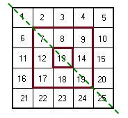
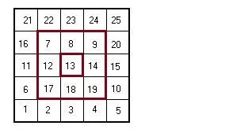

# Squarelotron

A Squarelotron consists basically of a matrix of numbers. This matrix can be decomposed as square rings which can flip independently in two different ways: Upside-Down and through the Main Diagonal.

The green line shows the main diagonal. Flipping the outer ring through the main diagonal means interchanging 2 and 6, 3 and 11, ..., 20 and 24.

The inverse diagonal would be a line running through 5, 9, 19, 17, and 21.

The squarelotron has two rings and a center piece. The outer ring contains the numbers 1, 2, 3, 4, 5, 6, 10, 11, 15, 16, 20, 21, 22, 23, 24, 25, while the inner ring contains 7, 8, 9, 12, 14, 17, 18, 19. The number 13 is by itself in the center.

A Upside-Down Flip of the outer ring of the squarelotron yields:

A Flip through the Main Diagonal of the outer ring of the squarelotron yields:

Since the squarelotron is a physical object, it can be simply rotated. For example, if the top row of the 4x4 squarelotron contains (1, 2, 3, 4) and the squarelotron is rotated right by 90 degrees, then the rightmost column of the squarelotron will contain (1, 2, 3, 4). This is not considered a "flip."

Note that while we have only shown you 4 by 4 and 5 by 5 squarelotrons, the flip concept and rotation concept extends to any n by n squarelotron.

We will say that the maximum size of the squarelotron is 8 by 8.

We want to write a program that will help us flip and rotate squarelotrons.

We also want you to write this program in a test driven manner. For each of the methods we describe below, please begin by writing the stub of a method and then writing unit tests for it (in SquarelotronTest.java)

Make a class called Squarelotron with the following instance variables

1. int[][] squarelotron.
2. int size

## Constructors
Squarelotron should have a constructor.

1. **Squarelotron(int n)** - It fills the 2-dimensional array with the numbers 1 to n squared, in order. It also sets the size instance variable to be n.

Note that you could do this with a switch statement for case 4,5,6,7 and 8 individually. That would not be considered wrong but you might want to pause and think about whether there is some kind of pattern that you can exploit which may be generalizable.

## Methods
In each of the following methods, the ring should be a number and we number from the outermost ring being the number 1.

1. **Squarelotron upsideDownFlip(int ring)** 
This method performs the Upside-Down Flip of the squarelotron, as described above, and returns the new squarelotron. The original squarelotron should not be modified (we will check for this).

2. **Squarelotron mainDiagonalFlip(int ring)**
This method performs the Main Diagonal Flip of the squarelotron, as described above, and returns the new squarelotron. The original squarelotron should not be modified (we will check for this).

3. **void rotateRight(int numberOfTurns)**
The argument numberOfTurns indicates the number of times the entire squarelotron should be rotated 90° clockwise. Any integer, including zero and negative integers, is allowable as the argument. A value of -1 indicates a 90° counterclockwise rotation. This method modifies the internal representation of the squarelotron; it does not create a new squarelotron.